# Informe de Refactorización ED06_3
## Adrián Rodríguez Fariña

---

## Code Smells Identificados y Refactorizaciones

### 1. Campos públicos en `Cliente.java`

Los atributos de la clase `Cliente` eran todos `public`, lo que permite que cualquier clase los modifique directamente sin control.

```java
// Antes
public int id;
public String nombre;
public String dni;
public String email;
public boolean esVip;
```

Se cambiaron a `private` y se generaron los getters y setters con la herramienta de IntelliJ IDEA (**Code → Generate → Getter and Setter**).

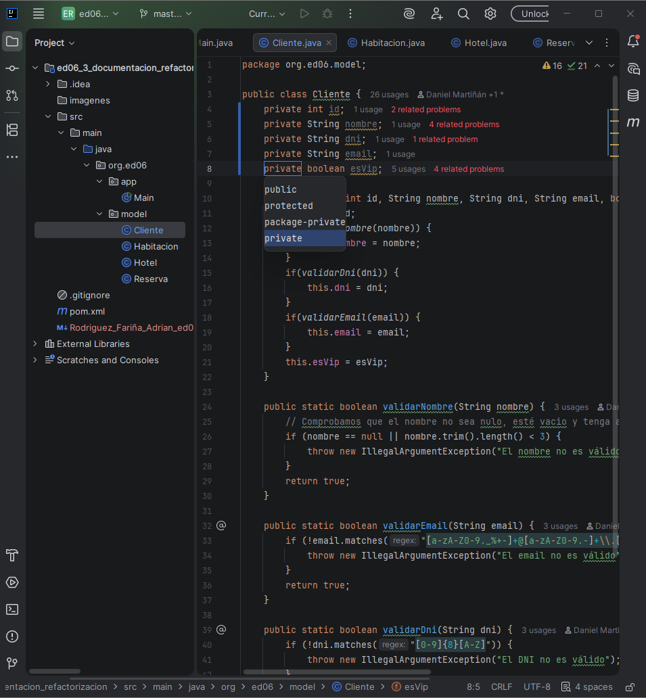
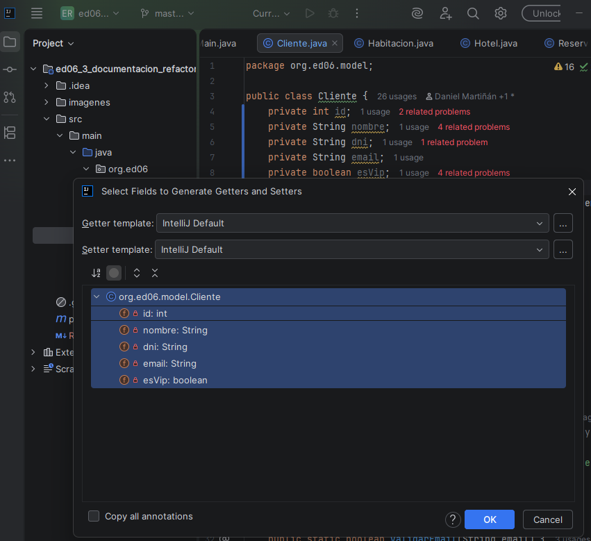
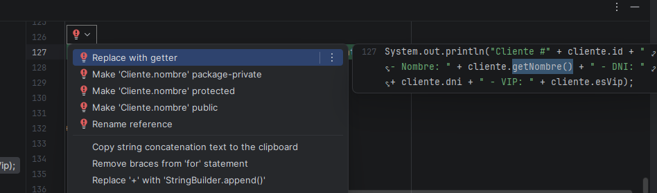

---

### 2. Retorno booleano innecesario en los validadores de `Cliente.java`

Los métodos `validarNombre`, `validarEmail` y `validarDni` siempre devolvían `true` o lanzaban una excepción, por lo que el tipo de retorno `boolean` no tenía sentido.

```java
// Antes
public static boolean validarNombre(String nombre) {
    if (nombre == null || nombre.trim().length() < 3) {
        throw new IllegalArgumentException("El nombre no es válido");
    }
    return true;
}
```

Se cambió el tipo de retorno a `void` usando **Refactor → Change Signature** en IntelliJ, y se eliminaron los `return true`. También se simplificó el constructor quitando los `if` innecesarios.

```java
// Después
public static void validarNombre(String nombre) {
    if (nombre == null || nombre.trim().length() < 3) {
        throw new IllegalArgumentException("El nombre no es válido");
    }
}
```

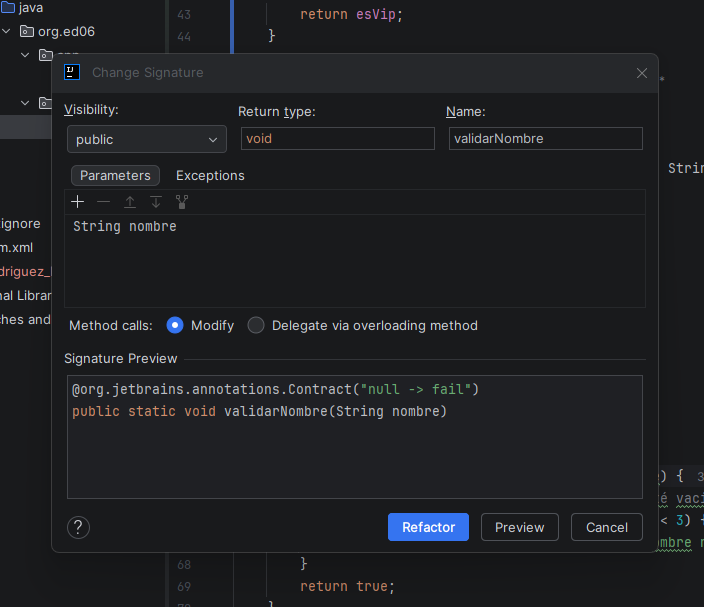
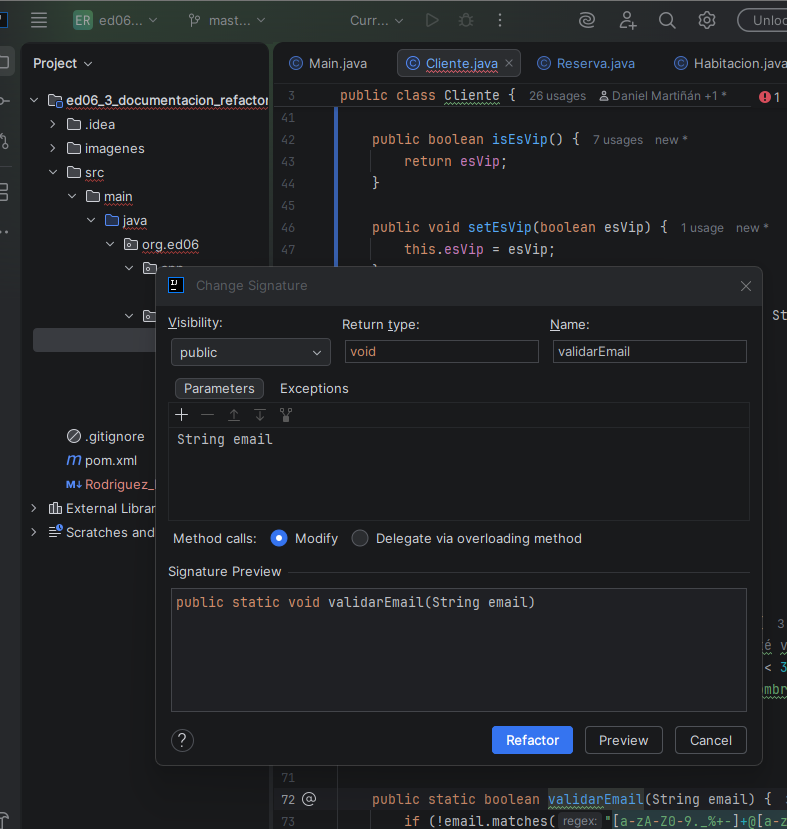
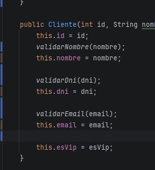

---

### 3. Lógica invertida en `reservar()` de `Habitacion.java`

El método `reservar()` tenía la lógica al revés: mostraba el mensaje cuando la habitación estaba disponible y ponía `disponible = true` en lugar de `false`.

```java
// Antes
public void reservar() {
    if (disponible) {
        System.out.println("Habitación #" + numero + " ya reservada");
    }
    disponible = true;
}
```

Se usó **Invert if condition** para invertir la condición, se añadió Early Return y se corrigió el valor de `disponible`.

```java
// Después
public void reservar() {
    if (!disponible) {
        System.out.println("Habitación #" + numero + " ya reservada");
        return;
    }
    disponible = false;
}
```

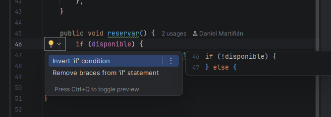

---

### 4. Tipo de retorno incorrecto en `obtenerNumMaxHuespedes()` de `Habitacion.java`

El método devolvía `double` cuando el número de huéspedes siempre es un número entero.

Se cambió a `int` con **Refactor → Change Signature**.

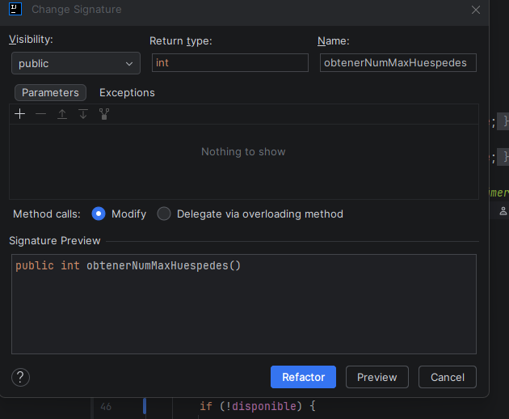

---

### 5. Comentario TODO sin resolver en `Habitacion.java`

Había un comentario TODO que indicaba trabajo pendiente que nunca se realizó.

```java
//Todo pendiente cambiar la forma de gestionar la disponibilidad
// en base a las fechas de las reservas
```

Se identificó con el panel TODO de IntelliJ y se eliminó el comentario.

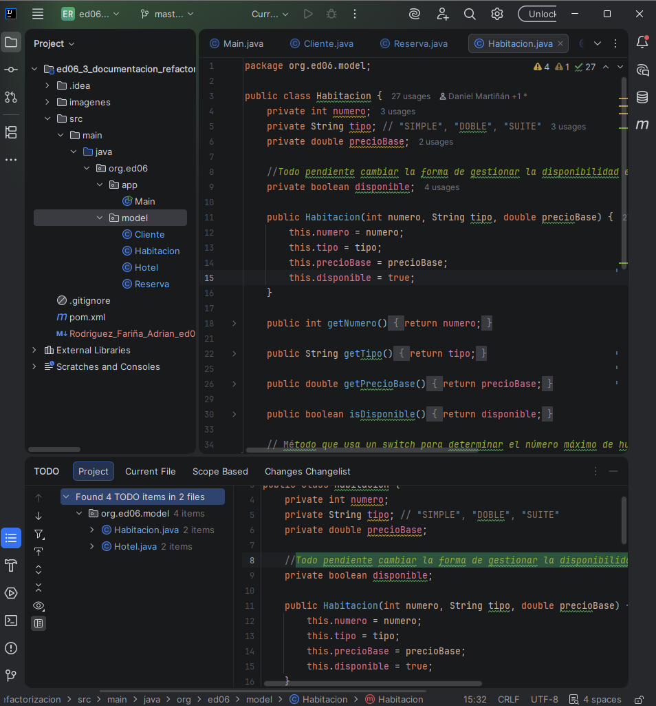

---

### 6. Import no utilizado en `Reserva.java`

`java.util.Date` estaba importado pero no se usaba en ningún momento.

Se eliminó con **Alt+Intro → Remove unused imports**.

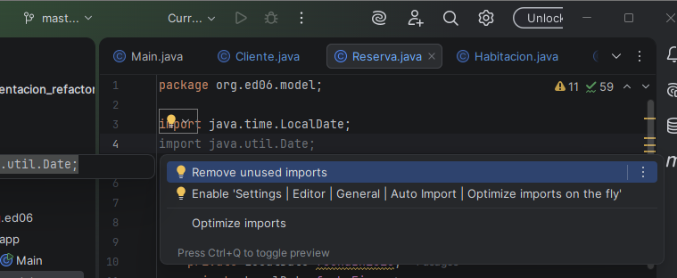

---

### 7. Nombres de variables poco descriptivos en `Reserva.java`

Las variables `n`, `pb` y `pf` no indican qué representan.

```java
// Antes
int n = fechaFin.getDayOfYear() - fechaInicio.getDayOfYear();
double pb = habitacion.getPrecioBase() * n;
double pf = pb;
```

Se renombraron usando **Refactor → Rename**.

```java
// Después
int numeroNoches = fechaFin.getDayOfYear() - fechaInicio.getDayOfYear();
double precioBase = habitacion.getPrecioBase() * numeroNoches;
double precioFinal = precioBase;
```

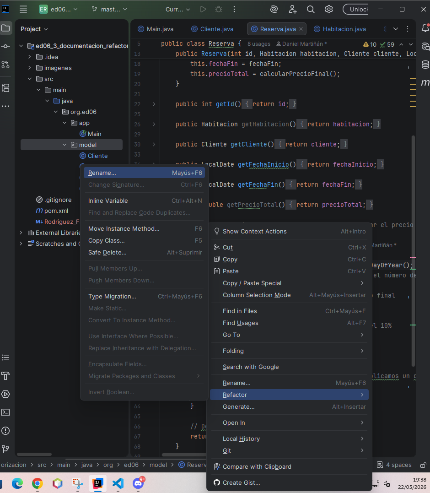

---

### 8. Magic Numbers en `Reserva.java`

Los valores `0.9`, `0.95` y `7` aparecían directamente en el código sin explicación.

Se extrajeron como constantes con **Refactor → Introduce Constant**.

```java
// Después
public static final double DESCUENTO_VIP = 0.9;
public static final double DESCUENTO_ESTANCIA_LARGA = 0.95;
public static final int DIAS_ESTANCIA_LARGA = 7;
```

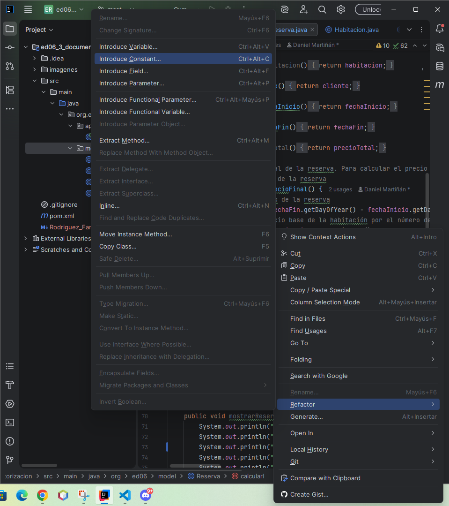

---

### 9. Ifs anidados y código inalcanzable en `Hotel.java`

El método `reservarHabitacion` tenía 4 niveles de anidamiento y un `return 0` al final que nunca se ejecutaba.

```java
// Antes (simplificado)
if(!habitaciones.isEmpty()) {
    if(cliente != null) {
        if(fechaEntrada.isBefore(fechaSalida)) {
            // lógica...
        }
    }
}
return 0; // inalcanzable
```

Se aplicó Early Return con **Invert if condition** en cada `if` y se eliminó el `return 0`.

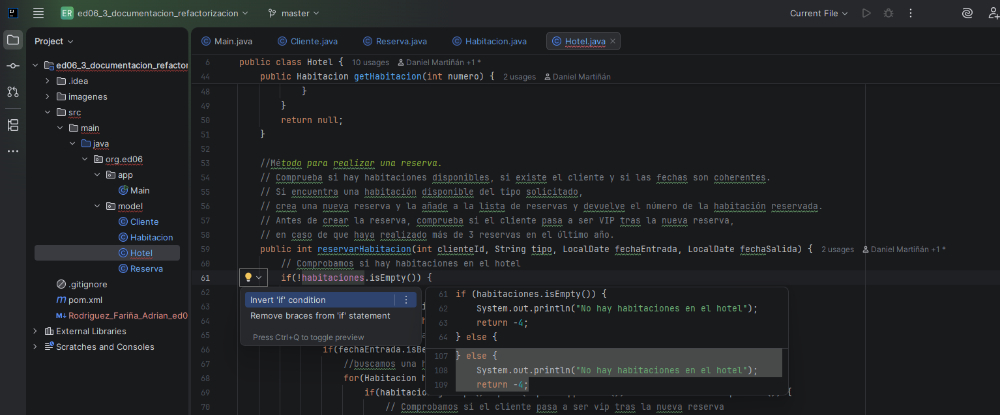

---

### 10. Lógica de comprobación VIP incrustada en `Hotel.java`

El bloque de código para comprobar si el cliente pasa a ser VIP estaba dentro del método `reservarHabitacion`, haciéndolo más largo y difícil de leer.

Se extrajo a un método privado `actualizarEstadoVip` con **Refactor → Extract Method**.

```java
// Después
private void actualizarEstadoVip(Cliente cliente) {
    int numReservas = 0;
    for (List<Reserva> reservasHabitacion : reservasPorHabitacion.values()) {
        for (Reserva reservaCliente : reservasHabitacion) {
            if (!reservaCliente.getCliente().equals(cliente)) continue;
            if (!reservaCliente.getFechaInicio().isAfter(LocalDate.now().minusYears(1))) continue;
            numReservas++;
        }
    }
    if (numReservas > 3 && !cliente.isEsVip()) {
        cliente.setEsVip(true);
        System.out.println("El cliente " + cliente.getNombre() + " ha pasado a ser VIP");
    }
}
```

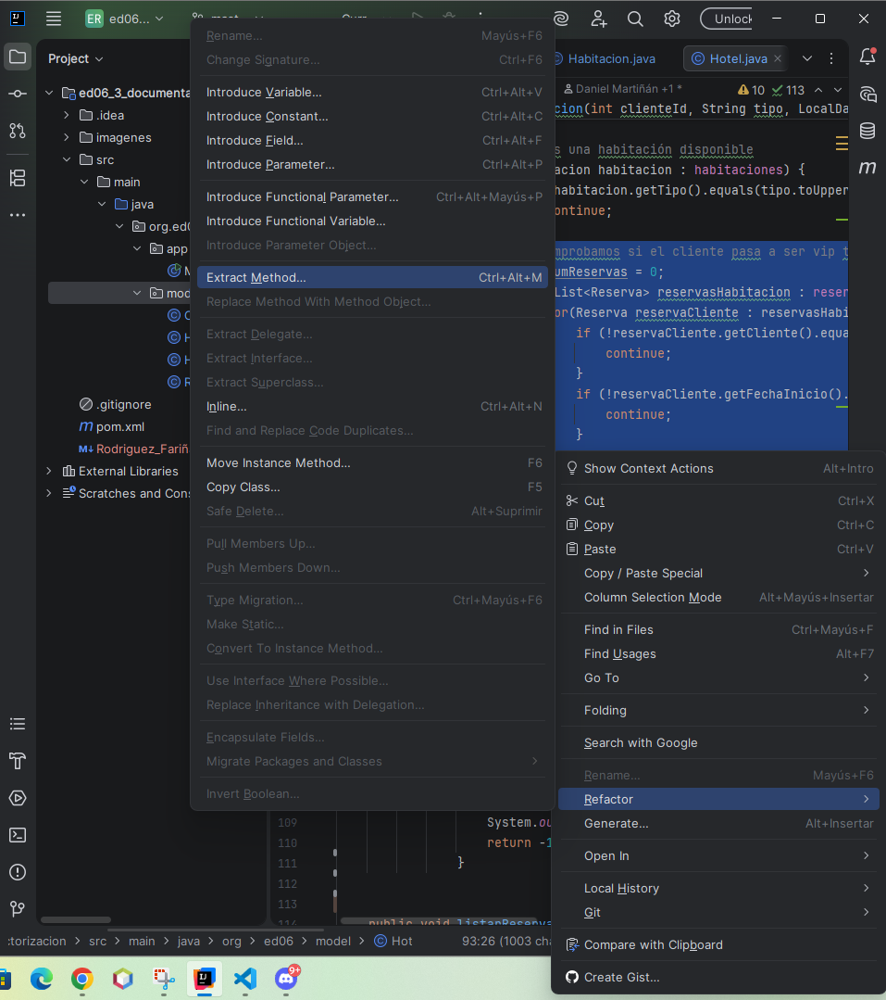

---

### 11. Método `main()` demasiado largo en `Main.java`

El método `main` tenía más de 100 líneas mezclando la lógica del menú con la lectura de datos.

Se extrajeron los bloques de cada opción a métodos privados con **Refactor → Extract Method**.

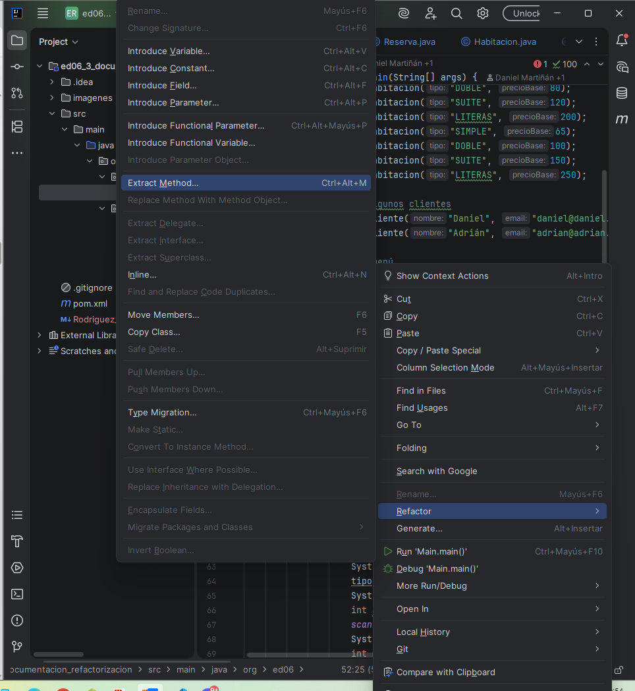

---

### 12. Código duplicado en validación de `Main.java`

El mismo patrón `while/try/catch` se repetía tres veces para validar nombre, email y DNI.

Se extrajeron a métodos separados con **Refactor → Extract Method**.

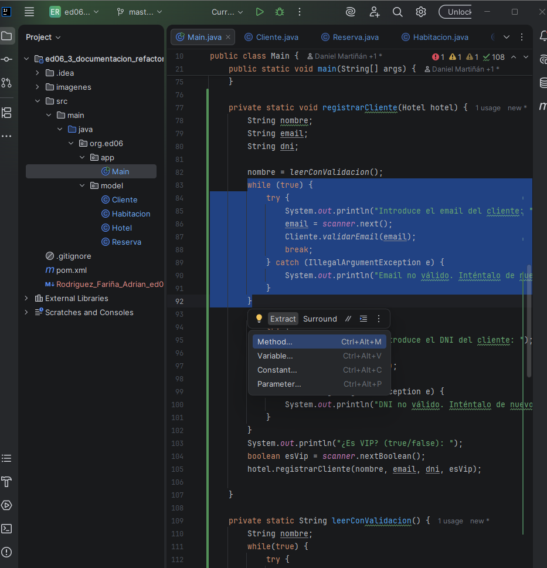

---

## Conclusiones

| Code Smell | Clase | Solución |
|---|---|---|
| Campos públicos | `Cliente` | Encapsulate Field |
| Retorno boolean innecesario | `Cliente` | Change Signature |
| Lógica invertida en reservar() | `Habitacion` | Invert if + Early Return |
| Tipo de retorno incorrecto | `Habitacion` | Change Signature |
| Comentario TODO sin resolver | `Habitacion` | Eliminar comentario |
| Import no utilizado | `Reserva` | Remove unused import |
| Variables poco descriptivas | `Reserva` | Rename |
| Magic Numbers | `Reserva` | Introduce Constant |
| Ifs anidados + código inalcanzable | `Hotel` | Early Return + Remove dead code |
| Lógica VIP incrustada | `Hotel` | Extract Method |
| Método main largo | `Main` | Extract Method |
| Código duplicado | `Main` | Extract Method |

